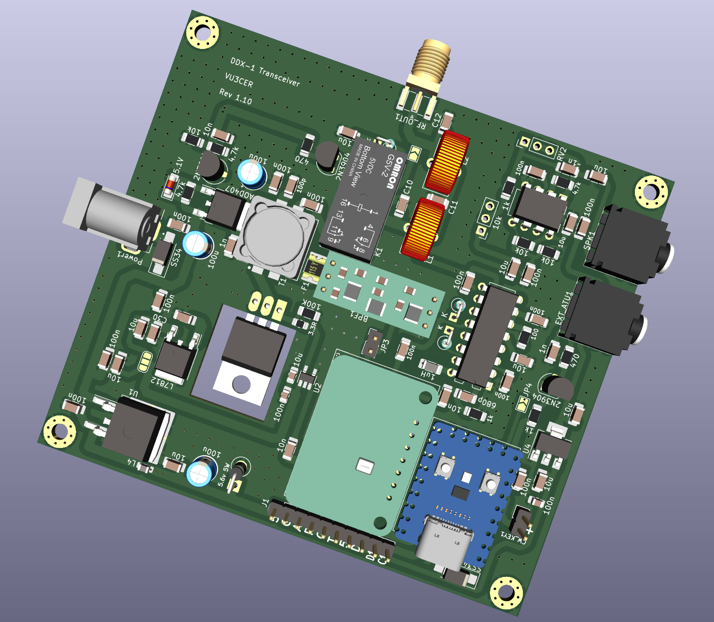
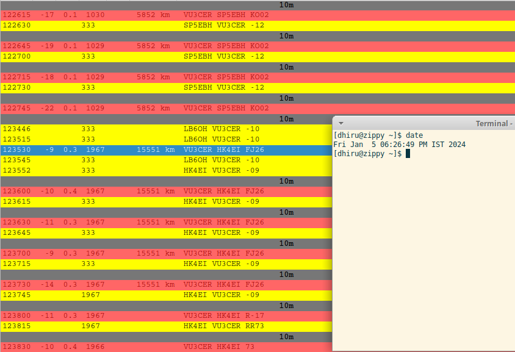
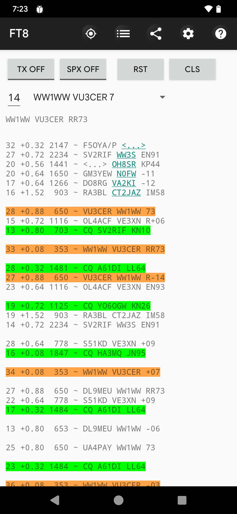
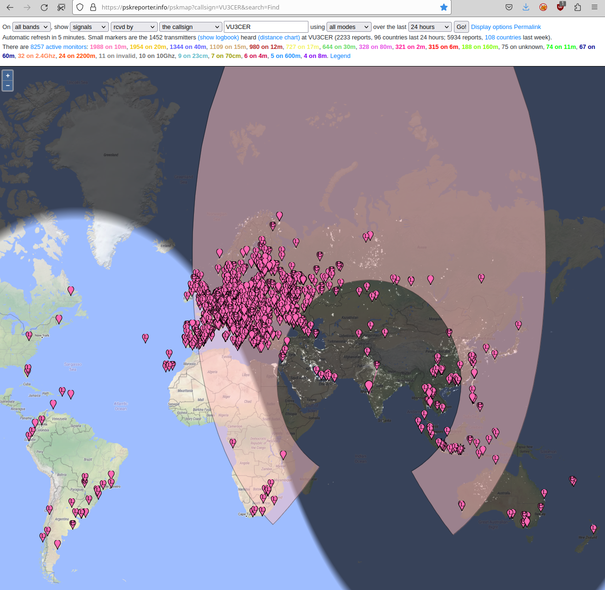
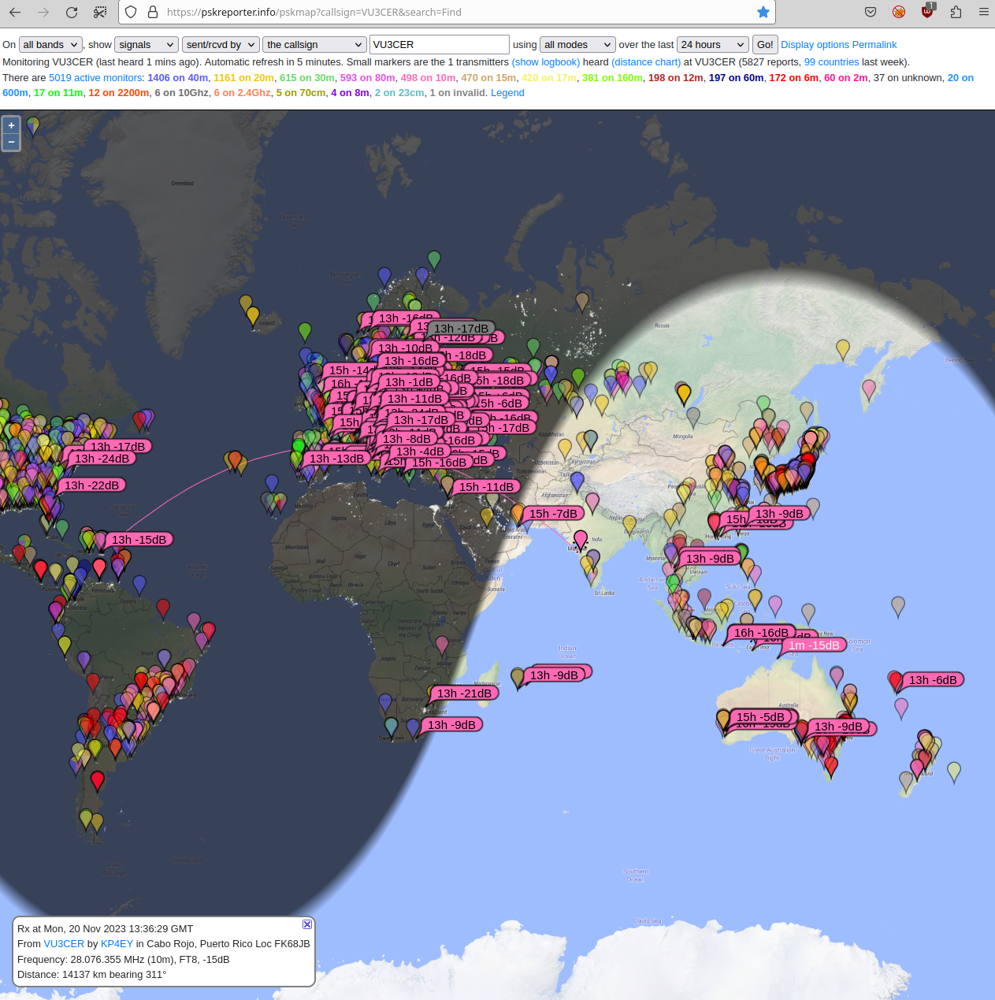
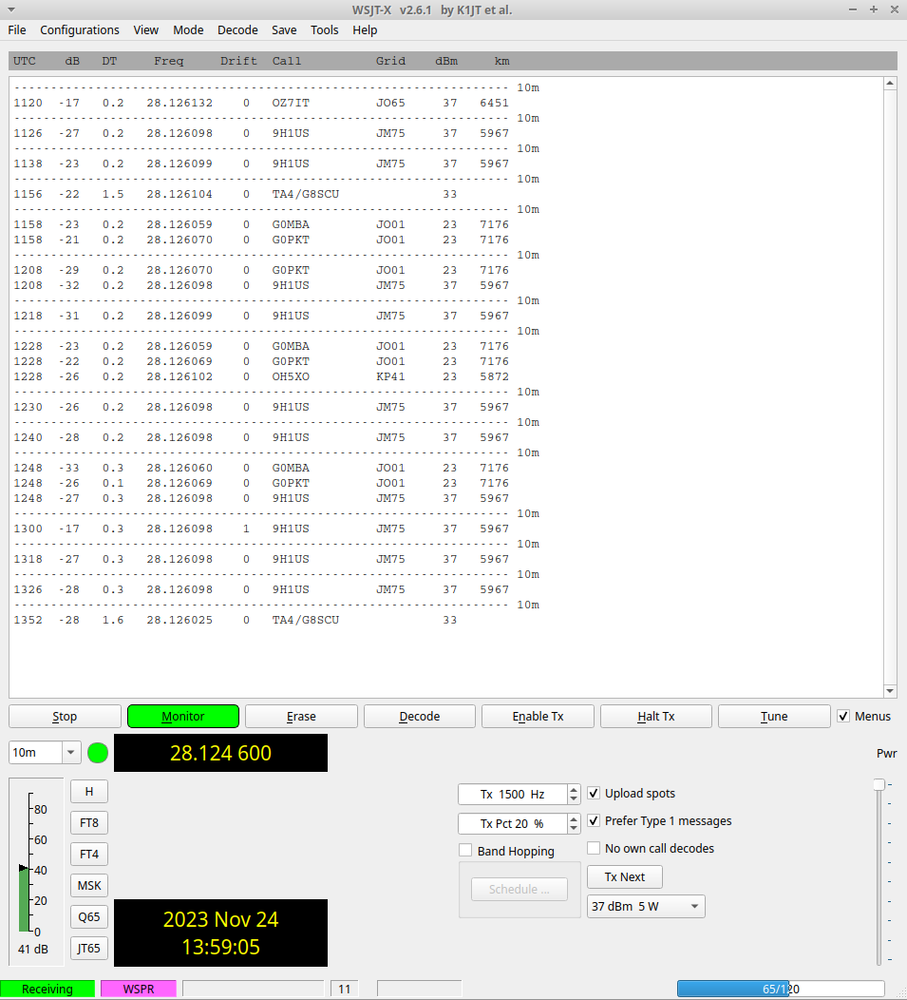
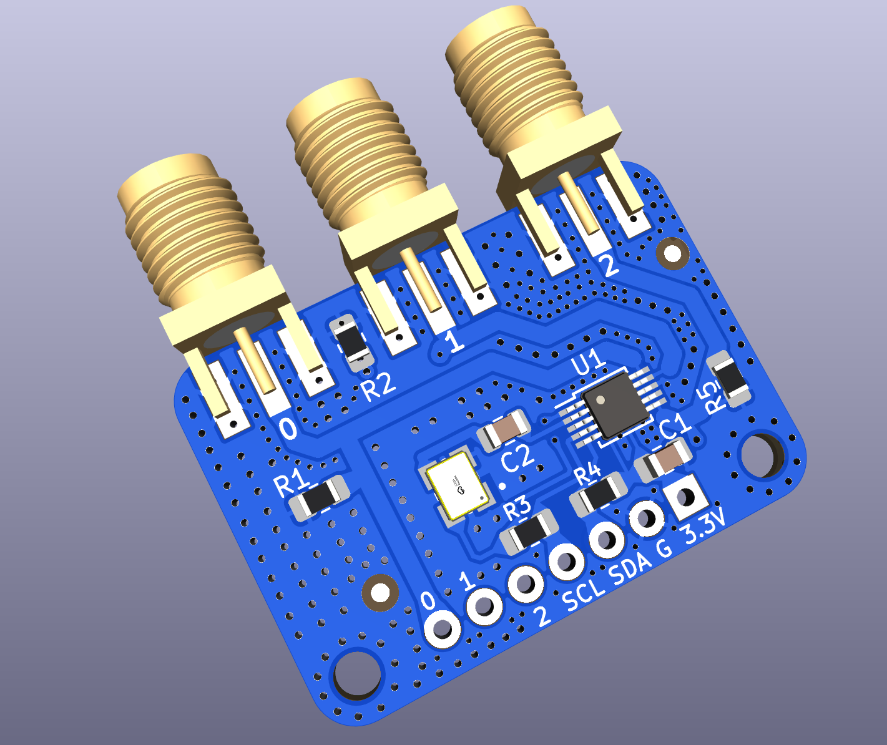

# Intro

The `Global Communications Transceiver` project. Global-Communications-Transceiver
is a 5W radio transceiver which is rugged, simple, and reliable.

It is a `optionally silent` digital radio which can be heard almost all over
the world!

Note: Receiving amateur and CB radio traffic without any license is fine in
most countries - please check your local regulations to be sure. Transmitting
on amateur shortwave bands usually requires an amateur radio license but you
are free to transmit and experiment on the CB band.

https://en.wikipedia.org/wiki/Citizens_band_radio_in_India

## Render



## Results

Sample contact from Pune to Medellin on 10m (15691km):



Another sample conact with `WW1WW` (Pune to USA):



## Features

- Single USB-C cable for handling both Audio + CAT control

- True 5W output on all HF bands. It even outputs ~1-2 W @ 50 MHz! (We now just
  need a 6m capable receiver section to build a 6m digital transceiver).

- Rock-solid PA which handles open, short, and bad SWR conditions (1:10 SWR
  tested). We knowingly stress-test it with untuned antennas and still manage
  DX (not a recommended practice for sure though).

- Rock-steady VFO which does NOT drift even under exposed conditions.  Yes - it
  receives WSPR at 28 MHz just fine.

- Reliable T/R switching based on a DPDT relay

- Switchable BPF support to get rid of BCI and other interferences (tested
  against OTH radar + 100 kW AM station in close visual proximity)

- No toroids to wind assuming an external LPF bank is in use ;-)

- The IRF510 final remains as cool as a cucumber (Class-D operation).

- Avoids problems associated with the 'audio frequency counting' approach used
  by earlier designs. Our transceiver has a bit-perfect, deterministic TX output.

- Supports largely automated assembly from JLCPCB (all the required files are
  in the same GitHub repository)

- It comes with a free, open-source AGPLv3 licensed firmware.

- No calibration is (ever) required. Just pick it up and it is ready to go
  on air.

- Low cost (20 to 30 USD is our BOM estimate)

- Stress tested by WSJT-Z for multiple days

- It routinely receives FT8 traffic from 80 to 100+ countries using a simple 5m
  long EFHW antenna

## RX Performance



Performance of CD2003-with-BPF is >= 80% of that of RSP1 SDR, at least!

## TX Performance



## VFO stability

It receives WSPR @ 28 MHz ;)



## WSPR TX Performance


## Files

With these files, you can get around 80% pre-assembled boards (with the SMD
components soldered) from JLCPCB at a minimal cost.

- [BOM](./design-files/HF-PA-v10.csv)

- [Gerbers + PCBA files](./design-files/jlcpcb/production_files)

- [Schematic](./design-files/Schematics.pdf)

Note: The Si5351+TCXO boards can be ordered in fully assembled form from
JLCPCB. https://github.com/kholia/Si5351-Module-Clone-TCXO/ has the required
files (use the `-v4` folder).



JLCPCB link: https://jlcpcb.com/

JLCPCB ordering guide: https://github.com/WB2CBA/ADX-UnO-V1.3/ has the JLCPCB
ordering guide in it.

## Building the firmware (for Linux users)

Shortcut: Upload the pre-built `.uf2` file to the RP2040 Board and skip
to the next section.

Install dependencies:

```
sudo apt install cmake gcc-arm-none-eabi libnewlib-arm-none-eabi \
  libstdc++-arm-none-eabi-newlib git libusb-1.0-0-dev build-essential \
  make g++ gcc
```

```
mkdir ~/repos
cd ~/repos
```

```
git clone --recursive https://github.com/kholia/tinyusb.git  # use this in pico-sdk
git clone --recursive https://github.com/raspberrypi/pico-sdk.git
git clone --recursive https://github.com/kholia/Global-Communications-Transceiver.git
```

Now build the firmware using instructions in the `firmware` folder.

Load the built `.uf2` file into the MCU board. Process: Hold the BOOT button on
RP2040-Zero, and then connect it to a computer. Release the BOOT button. A new
drive will open on the computer. Just drag the .uf2 firmware file (included in
the repository) to this new drive. Done!

## Power sources

The transceiver was tested with the following power sources.

- SUGON 3005D Adjustable Digital DC Power - RECOMMENDED

- 3S "12V" Li-ion 18650 battery pack (RECOMMENDED for field operations)

- RUIDENG DPS5020 power supply module (@13v) powered by MEAN WELL / Mornsun SMPS

## Safety Tips

- Use a Common-Mode-Choke (attached between the rig, and the antenna) for
  safety against `return/back RF`.

## Resources

- The `Global Communications Transceiver` project comes from our DDX family of
  transceiver designs - https://github.com/kholia/DDX/

- https://rf-tools.com/lc-filter/

- https://github.com/WB2CBA/ADX (the design that started it all)

- http://www.learningaboutelectronics.com/Articles/Low-pass-filter-calculator.php

- https://github.com/kholia/ConsensusBasedTimeSync (receiver comes from here)

- https://github.com/kholia/Si5351-Module-Clone-TCXO/ (VFO comes from here)

- https://github.com/kholia/HF-PA-v10 (PA comes from here)

  Ruggedness philosophy: https://www.youtube.com/watch?v=4r7wHMg5Yjg

- https://www.kk5jy.net/three-wire-gp/ (recommended antenna - superb for DX)

- https://github.com/kholia/HF-Balcony-Antenna-System (another portable antenna setup)

- https://github.com/batica81/microphone-library-for-pico (Vojislav's work makes DDX-1 possible)
